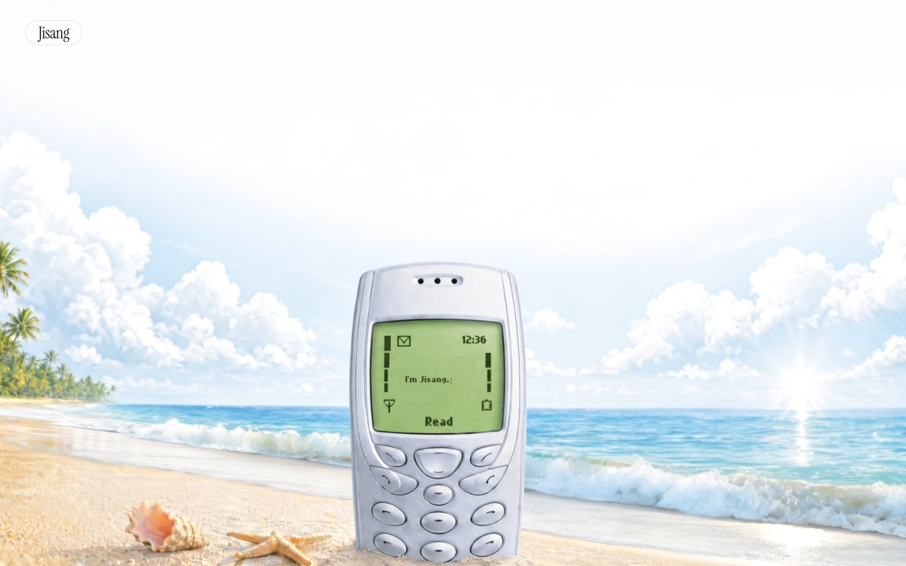

# Jisang — Portfolio

> 사용자 경험과 문제 해결에 집중하는 프론트엔드 개발자 홍지상(Jisang Hong)의 포트폴리오 원페이지 사이트

<p>
  <a href="https://portfolio-two-green-ize9itlxvm.vercel.app/"><strong>🌐 라이브 바로가기 →</strong></a>
</p>

[](https://portfolio-two-green-ize9itlxvm.vercel.app/)


<p align="center">
  <a href="https://portfolio-two-green-ize9itlxvm.vercel.app/">
    
  </a>
</p>

<p align="center"><em>여름 해변에 놓인 레트로 핸드폰 — 화면(LCD)의 타이핑 메시지가 방문자를 맞이하고, 핸드폰을 클릭 또는 아래로 스크롤하면 여정이 시작됩니다.</em></p>

---

## 개요

바이브 코딩으로 제작한 싱글 페이지 포트폴리오입니다.

레트로 감성과 여름 해변 무드를 결합해, 스크롤 한 번으로 자기소개 → 기술 스택 → 프로젝트 → 연락처가 자연스럽게 이어지도록 설계했습니다.

- **컨셉:** 해변에 놓인 핸드폰이 스크롤에 따라 화면 왼쪽으로 "여행"하며, 그 LCD가 곧 현재 위치를 알려주는 내비게이션이 됩니다.
- **타깃:** 채용 담당자 (데스크톱 중심, 모바일 대응)
- **형태:** One-page 랜딩 + 섹션 스크롤

## 기술 스택

| 구분          | 사용 기술                                                        |
| ------------- | ---------------------------------------------------------------- |
| **Core**      | React 19, TypeScript 5.7                                         |
| **Styling**   | Tailwind CSS v4 (테마 변수 기반 디자인 토큰)                     |
| **Animation** | motion (framer-motion) · Canvas 2D · requestAnimationFrame       |
| **Build**     | Vite 6                                                           |
| **Deploy**    | Vercel                                                           |
| **Fonts**     | Instrument Serif · Gowun Batang · Nokia Cellphone FC Small(도트) |

## 🤖 Claude Code & AI 활용

이 프로젝트는 **[Claude Code](https://claude.com/claude-code)를 개발 파트너로 적극 활용**해 기획부터 구현·리팩토링까지 진행했습니다. AI를 "코드를 대신 짜주는 도구"가 아니라, **의도를 구조화하고 반복 작업을 가속하는 협업자**로 사용한 것이 핵심입니다.

- **레퍼런스 프롬프트 기반 메인 페이지 (motion-sites, higgsfield.ai)**
  메인 히어로는 [motion-sites](https://www.motionsites.com/)의 **레퍼런스 프롬프트**(핸드폰 LCD·도트 폰트·타이핑 메시지·영상 배경 등, `prompt 예시.txt`)를 출발점으로 삼아 Claude Code로 React 19 + Tailwind v4 + motion 구조로 재구성했습니다. 또한 핸드폰의 3d 전체 이미지를 구현하기 위해 [higgsfield](https://higgsfield.ai/)를 사용하여 **AI 이미지**를 제작하여 **"여름 해변 + 레트로 핸드폰"**이라는 y2k 컨셉으로 저만의 정체성으로 발전시켰습니다.

- **PRD 주도 개발 (Spec-first)**
  요구사항을 먼저 `prd.md`(제품 요구사항 정의서)로 문서화하고, 이를 근거로 섹션·컴포넌트·디자인 토큰을 구현했습니다. 기획 → 구현의 흐름을 AI와 함께 문서 기반으로 관리했습니다.

- **디자인 · 리팩토링 협업**
  Anthropic의 `frontend-design` 스킬(`skills-lock.json`으로 버전 고정)을 활용해 타이포그래피·여백·색 토큰 등 시각적 완성도를 다듬고, 반복되는 상태 관리·성능 최적화(useMemo/useCallback, 커서 rAF 분리 등)를 함께 정리했습니다.

- **AI에 의존하지 않는 로직 (개인 프로젝트에서의 원칙)**
  한편, 포트폴리오에 담긴 개인 프로젝트(예: **Omok 오목**)는 **생성형 AI 없이 스스로 규칙을 분석·구현**하며 문제 해결력을 길렀습니다. 즉 *AI를 생산성 도구로 적극 활용하되, 핵심 로직에 대한 이해와 판단은 직접 갖는다*는 것이 저의 개발 태도입니다.

## 주요 기능 & 인터랙션

- 🏖️ **뷰포트 고정 배경** — 해변 영상이 화면에 고정되고, 스크롤을 내리면 블러 처리된 블루 워시가 서서히 덮여 섹션이 "끊기지 않고" 전환됩니다. (`SummerBackground`)
- 📱 **핸드폰** — 스크롤에 따라 상단 중앙에서 등장한 폰이 왼쪽으로 이동하며 도킹되고, LCD에 `ABOUT · SKILLS · PROJECT · CONTACT` 목록과 현재 섹션을 하이라이트해 **메뉴이자 "you are here" 인디케이터** 역할을 합니다. (`TravelingPhone`)
- ⌨️ **도트 타이핑 메시지** — 폰 LCD 위에 `Nice to meet u!` → `I'm Jisang.` → `Let's scroll!` 가 순환 타이핑됩니다. 깜빡이는 픽셀 커서까지 재현. (`TypingMessages`)
- ⭐ **불가사리 커스텀 커서** — 기본 커서를 숨기고, rAF lerp 루프로 부드럽게 따라오는 불가사리 커서로 대체. hover/press 시 상태가 바뀝니다. (`CustomCursor`)
- 🏝️ **모래 알갱이 트레일** — 커서를 움직이면 모래알이 튀어오르고 중력에 따라 떨어지며 사라지는 Canvas 기반 트레일. (`SandTrail`)
- 📜 **부드러운 스크롤 & 등장 애니메이션** — 섹션 앵커 스무스 스크롤 + motion 기반 fade/slide-in.
- 📱 **반응형** — 모바일 / 태블릿 / 데스크톱 대응. 무거운 커서·트레일·여행 폰 효과는 `(hover: hover)` 데스크톱에서만 활성화해 터치 기기 성능을 보호합니다.

## 프로젝트 구조

```
portfolio/
├─ index.html                 # 폰트 preconnect · 메타 태그 진입점
├─ prd.md                     # 제품 요구사항 정의서 (Spec-first 개발의 기준)
├─ prompt 예시.txt            # 메인 페이지 레퍼런스 프롬프트 (motion-sites 계열)
├─ docs/
│  └─ preview.png             # README 대표 이미지
├─ src/
│  ├─ App.tsx                 # 배경 · 커서 · 내비 · 섹션 조립
│  ├─ components/
│  │  ├─ SummerBackground.tsx #  고정 해변 배경 + 스크롤 블러 전환
│  │  ├─ TravelingPhone.tsx   #  스크롤에 따라 이동하는 핸드폰 = 메뉴
│  │  ├─ TypingMessages.tsx   #  LCD 타이핑 애니메이션
│  │  ├─ CustomCursor.tsx     #  불가사리 커스텀 커서
│  │  ├─ SandTrail.tsx        #  모래 알갱이 커서 트레일
│  │  ├─ Hero / About / Skills / Portfolio / Contact
│  │  └─ ProjectModal.tsx     #  프로젝트 상세(케이스 스터디) 모달
│  ├─ data/
│  │  ├─ projects.ts          #  프로젝트 데이터 (기여도 · 트러블슈팅)
│  │  └─ skills.ts            #  기술 스택 · 협업 툴
│  └─ index.css               # Tailwind 테마 변수 · 도트 폰트 import
└─ vite.config.ts
```

## 시작하기

```bash
# 의존성 설치
npm install

# 개발 서버 (http://localhost:5173)
npm run dev

# 프로덕션 빌드 (tsc 타입체크 + vite build)
npm run build

# 빌드 결과 미리보기
npm run preview
```

---

<p align="center"><sub>Built with React · Tailwind CSS · motion — and crafted alongside <a href="https://claude.com/claude-code">Claude Code</a> 🤖</sub></p>
